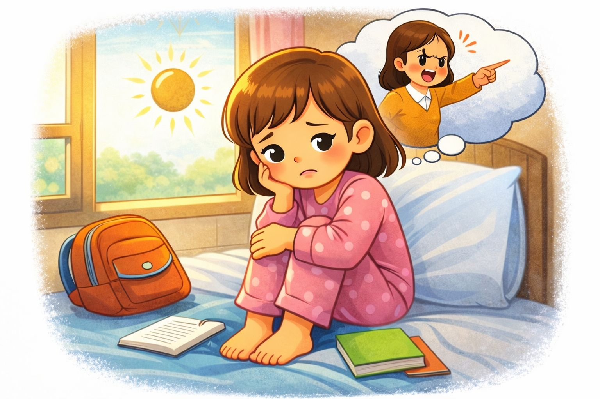
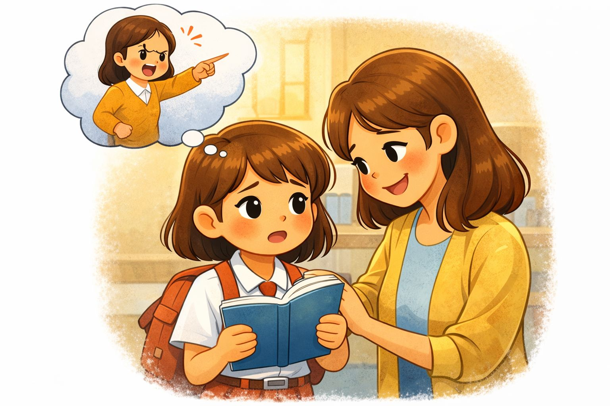
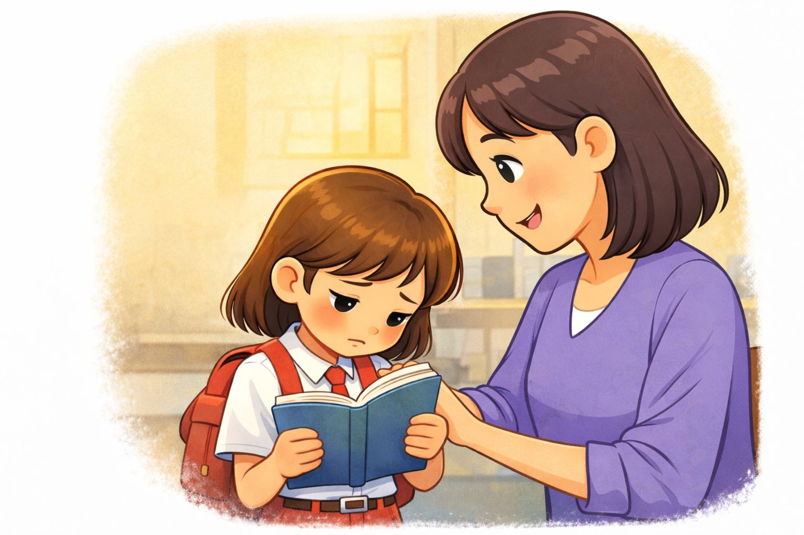
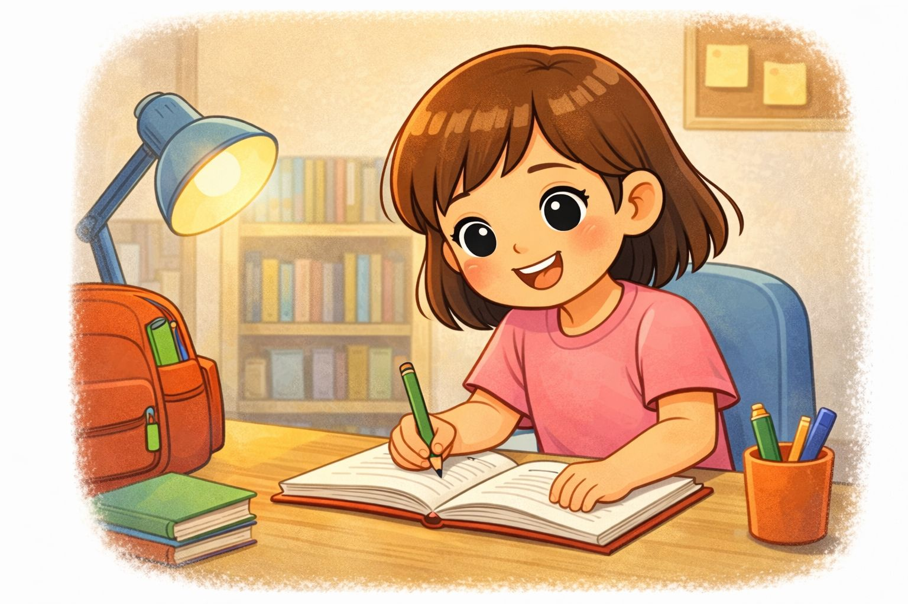

# cerita-nina
<html>
<head>
    <title>Halaman1</title>
</head>
<body>

       
Pagi hari yang cerah, Nina duduk diam di tempat tidurnya.
            Hari itu ia harus pergi ke sekolah..

        
 Namun, ada satu hal yang membuatnya gelisah.
            Tugas sekolahnya belum selesai.

        
 Nina merasa takut dan khawatir. Ia membayangkan akan dimarahi oleh Bu Guru..

   
           
           <h2>1</h2>

         
        <a href="halaman2.html">berikutnya ➜</a>

      

</body>
</html>

<html>
<head>
    <title>Halaman 2</title>
</head>
<body>

       
Dengan wajah cemas, Nina berkata kepada Ibu,
“Aku takut dimarahi Bu Guru karena tugasku belum selesai.”

         
Ibu tersenyum lembut lalu berkata,
“Kalau kita jujur dan mau memperbaiki kesalahan, Bu Guru pasti akan mengerti.”

Nina mendengarkan nasihat Ibu dengan saksama

 

<h2>2</h2>

 
<a href="halaman3.html">berikutnya ➜</a>

</body>
</html>

<html>
<head>
    <title>Halaman 3</title>
</head>
<body>

       
Sesampainya di sekolah, Nina mencoba menenangkan hatinya.
Ia pun memberanikan diri berbicara kepada Bu Guru.

“Bu, maaf, tugas saya belum selesai,” kata Nina dengan jujur.

Ternyata, Bu Guru tidak marah.
Bu Guru malah tersenyum dan memberi Nina waktu untuk menyelesaikan tugasnya.

 

<h2>3</h2>

 
<a href="halaman4.html">berikutnya ➜</a>

</body>
</html>

<html>
<head>
    <title>Halaman 4</title>
</head>
<body>

       
Nina merasa sangat lega dan senang.
Ia belajar bahwa berkata jujur dan berani mengakui kesalahan itu penting.

Sejak hari itu, Nina menjadi lebih rajin dan tidak takut lagi pergi ke sekolah karena tidak mengerjakan tugas.

Ia tahu, kejujuran selalu membawa kebaikan.

 

<h2>4</h2>

 
<a href="halaman5.html">berikutnya ➜</a>

</body>
</html>

<html>
<head>
    <title>Halaman 5</title>
</head>
<body>

       
 Soal

      
1. Siapa nama tokoh utama dalam cerita ini?
Jawaban: _________

2. Mengapa Nina merasa takut pada pagi hari?
Jawaban: _________

3. Kepada siapa Nina bercerita tentang rasa takutnya?
Jawaban: _________

4.Bagaimana sikap Bu Guru saat Nina berkata jujur?
Jawaban: _________

5. Bagaimana perasaan Nina setelah berbicara jujur?
Jawaban: _________

6.Apa pelajaran yang kamu dapat dari cerita ini?
Jawaban: _________

          
      

<h2>5</h2>

 
<a href="halaman0.html">berikutnya ➜</a>

</body>
</html

